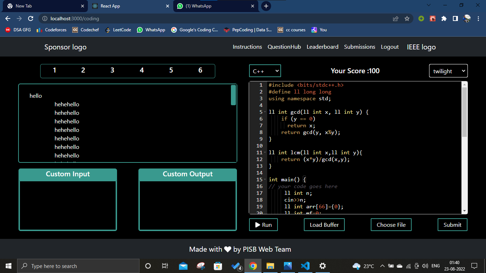

# CTD_NCC_22
<a name="readme-top"></a>

<!-- PROJECT SHIELDS -->
<!--
*** I'm using markdown "reference style" links for readability.
*** Reference links are enclosed in brackets [ ] instead of parentheses ( ).
*** See the bottom of this document for the declaration of the reference variables
*** for contributors-url, forks-url, etc. This is an optional, concise syntax you may use.
*** https://www.markdownguide.org/basic-syntax/#reference-style-links
-->
<!-- [![Contributors][https://github.com/yashp2]]
[![LinkedIn][https://www.linkedin.com/in/yash-patil-9b4650205/]] -->


<!-- PROJECT LOGO -->
<br />
<div align="center">
<!--   <a href="https://github.com/github_username/repo_name">
    
  </a> -->

<h2 align="center">NCC Website for CREDENZ TECH DAYS</h2>

  <p >
    • Developed an Online Coding Judge platform used by 600+ contestants with
the objective of hosting coding contests and dynamically calculating
real-time rankings based on contestant submissions.
    <br />
• Used React.js along with react-router and Ace Code-Editor on the client
side enhancing user experience.
    <br />
• Forthe server-side we used Express.js for API development i.e.
Login/Signups , Questions, Code-Runners , Submissions, Leaderboard etc.
    <br />
• Used MongoDB as a database,Redis-Bull to maintain queue to run and
submit Contestant’s code.
    <br />
• Docker to containerize the project, Judge0 as code execution engine, and
lastly hosted the project on AWS EC2 instances with a load balancerrunning
    <br />
<!--     <a href="https://github.com/github_username/repo_name"><strong>Explore the docs »</strong></a>
    <br /> -->
<!--     <br /> -->
<!--     <a href="https://github.com/github_username/repo_name">View Demo</a> -->
<!--     ·
    <a href="https://github.com/github_username/repo_name/issues">Report Bug</a>
    ·
    <a href="https://github.com/github_username/repo_name/issues">Request Feature</a> -->
  </p>
</div>

<!-- ABOUT THE PROJECT -->
## About The Project

[![Run Workflow][product-screenshot1]]
[![Submission Workflow][product-screenshot2]]
[![Coding Page][product-screenshot3]]
[![Leaderboard Page][product-screenshot4]]
[![Submissions Page][product-screenshot5]]
[![Testcases Page][product-screenshot6]]

### Built With

* [![React][React.js]][React-url]
* [![Bootstrap][Bootstrap.com]][Bootstrap-url]

<!-- GETTING STARTED -->
## Getting Started

This is an example of how you may give instructions on setting up your project locally.
To get a local copy up and running follow these simple example steps.

### Prerequisites

You Just need NPM / YARN installed on your PC
<!-- * npm
  ```sh
  npm install npm@latest -g
  ```
 -->
### Installation

<!-- 1. Get a free API Key at [https://example.com](https://example.com) -->
2. Clone the repo
   ```sh
   git clone https://github.com/yashp2/CTD-NCC-FRONTEND-22
   ```
3. Install NPM packages
   ```sh
   npm install
   ```
4. Start the project by command `npm start`
   ```sh
   npm start
   ```
<!-- CONTACT -->
## Contact

Your Name - Yash Patil

Project Link: [https://github.com/yashp2/CTD-NCC-FRONTEND-22]

<p align="right">(<a href="#readme-top">back to top</a>)</p>


<!-- MARKDOWN LINKS & IMAGES -->
<!-- https://www.markdownguide.org/basic-syntax/#reference-style-links -->
[contributors-shield]: https://img.shields.io/github/contributors/github_username/repo_name.svg?style=for-the-badge
[contributors-url]: https://github.com/github_username/repo_name/graphs/contributors
[forks-shield]: https://img.shields.io/github/forks/github_username/repo_name.svg?style=for-the-badge
[forks-url]: https://github.com/github_username/repo_name/network/members
[stars-shield]: https://img.shields.io/github/stars/github_username/repo_name.svg?style=for-the-badge
[stars-url]: https://github.com/github_username/repo_name/stargazers
[issues-shield]: https://img.shields.io/github/issues/github_username/repo_name.svg?style=for-the-badge
[issues-url]: https://github.com/github_username/repo_name/issues
[license-shield]: https://img.shields.io/github/license/github_username/repo_name.svg?style=for-the-badge
[license-url]: https://github.com/github_username/repo_name/blob/master/LICENSE.txt
[linkedin-shield]: https://img.shields.io/badge/-LinkedIn-black.svg?style=for-the-badge&logo=linkedin&colorB=555
[linkedin-url]: https://www.linkedin.com/in/yash-patil-9b4650205/
[product-screenshot1]: Screenshots/OJ_Run_Workflow.png
[product-screenshot2]: Screenshots/OJ_Submission_Workflow.png
[product-screenshot3]: Screenshots/Coding.png
[product-screenshot4]: Screenshots/leaderboard.png
[product-screenshot5]: Screenshots/submissions.png
[product-screenshot6]: Screenshots/testcases.png
[Next.js]: https://img.shields.io/badge/next.js-000000?style=for-the-badge&logo=nextdotjs&logoColor=white
[Next-url]: https://nextjs.org/
[React.js]: https://img.shields.io/badge/React-20232A?style=for-the-badge&logo=react&logoColor=61DAFB
[React-url]: https://reactjs.org/
[Vue.js]: https://img.shields.io/badge/Vue.js-35495E?style=for-the-badge&logo=vuedotjs&logoColor=4FC08D
[Vue-url]: https://vuejs.org/
[Angular.io]: https://img.shields.io/badge/Angular-DD0031?style=for-the-badge&logo=angular&logoColor=white
[Angular-url]: https://angular.io/
[Svelte.dev]: https://img.shields.io/badge/Svelte-4A4A55?style=for-the-badge&logo=svelte&logoColor=FF3E00
[Svelte-url]: https://svelte.dev/
[Laravel.com]: https://img.shields.io/badge/Laravel-FF2D20?style=for-the-badge&logo=laravel&logoColor=white
[Laravel-url]: https://laravel.com
[Bootstrap.com]: https://img.shields.io/badge/Bootstrap-563D7C?style=for-the-badge&logo=bootstrap&logoColor=white
[Bootstrap-url]: https://getbootstrap.com
[JQuery.com]: https://img.shields.io/badge/jQuery-0769AD?style=for-the-badge&logo=jquery&logoColor=white
[JQuery-url]: https://jquery.com 
